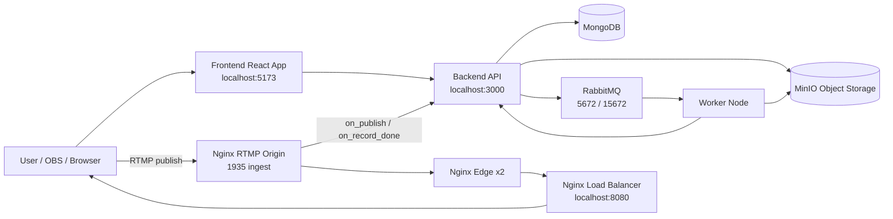

# HexaNodes Distributed Video Platform

HexaNodes is a distributed video system that supports:

- authenticated video uploads
- asynchronous transcoding and HLS generation
- thumbnail generation and storage
- live streaming ingest via RTMP
- live edge delivery via Nginx
- real-time video status updates on the frontend

This repository contains the complete system: frontend, backend API, async worker, and edge/origin infrastructure.

## Table of Contents

- [System Overview](#system-overview)
- [Architecture](#architecture)
- [Tech Stack](#tech-stack)
- [Repository Structure](#repository-structure)
- [Getting Started](#getting-started)
- [Environment Configuration](#environment-configuration)
- [Runtime Services and Ports](#runtime-services-and-ports)
- [Storage and Queue Contracts](#storage-and-queue-contracts)
- [Workflows](#workflows)
- [API Reference](#api-reference)
- [Frontend Routes](#frontend-routes)
- [Operational Notes](#operational-notes)
- [Troubleshooting](#troubleshooting)

## System Overview

HexaNodes follows a hybrid architecture:

- Infrastructure and worker run in Docker via `docker-compose.yml`
- Backend API and frontend run locally during development

Main user journeys:

1. Register/login and receive JWT access/refresh tokens.
2. Upload video (and optional custom thumbnail).
3. Backend stores raw file in MinIO and sends processing job to RabbitMQ.
4. Worker transcodes to HLS, uploads processed assets, and notifies backend via webhook.
5. Frontend tracks status with Server-Sent Events (SSE) and updates watch page automatically.
6. Users can also stream live through OBS to RTMP origin and watch via load-balanced edges.

## Architecture



## Tech Stack

- Frontend: React 19, React Router, Vite, Tailwind CSS v4, HLS.js, Sonner, Lucide
- Backend API: Node.js, Express 5, MongoDB (Mongoose), JWT, Multer, MinIO SDK, RabbitMQ (amqplib)
- Worker: Node.js, FFmpeg/ffprobe, MinIO SDK, RabbitMQ consumer, Axios webhook client
- Streaming/Edge: Nginx RTMP origin, Nginx edge proxies, Nginx load balancer
- Infra: Docker Compose

## Repository Structure

```text
backend-api/        Express API (auth, videos, webhooks)
frontend/           React UI (home, watch, upload, dashboard, settings)
worker-node/        Async transcoding worker (RabbitMQ consumer + FFmpeg)
nginx-origin/       RTMP ingest + HLS generation + stream webhooks
nginx-edge/         Edge cache/proxy for live HLS delivery
nginx-lb/           Load balancer in front of edge nodes
docker-compose.yml  Infrastructure and worker orchestration
```

## Getting Started

### 1. Prerequisites

- Node.js 20+
- npm 10+
- Docker Desktop

### 2. Start infrastructure + worker

From the repository root:

```bash
docker-compose up -d
```

This starts MongoDB, RabbitMQ, MinIO, RTMP origin, two edge nodes, load balancer, and the worker.

### 3. Configure and run backend API

```bash
cd backend-api
npm install
cp .env.example .env
```

Update `.env` with required values (see Environment Configuration), then run:

```bash
npm run dev
```

Backend runs at `http://localhost:3000`.

### 4. Run frontend

```bash
cd frontend
npm install
npm run dev
```

Frontend runs at `http://localhost:5173` by default.

## Environment Configuration

### Backend (`backend-api/.env`)

Minimum recommended variables:

```env
PORT=3000
CORS_ORIGIN=http://localhost:5173

MONGO_URI=mongodb://localhost:27017

ACCESS_TOKEN_SECRET=your_access_secret
ACCESS_TOKEN_EXPIRY=1d
REFRESH_TOKEN_SECRET=your_refresh_secret
REFRESH_TOKEN_EXPIRY=10d

# Used by MinIO SDK credentials fallback
MINIO_ACCESS_KEY=admin
MINIO_SECRET_KEY=password123
```

Notes:

- `backend-api/.env.example` is minimal and does not include all JWT/CORS variables used in code.
- Backend MinIO endpoint/port/bucket names are currently defined in `backend-api/src/constants.js`.

### Worker (`worker-node`)

Worker uses hardcoded defaults in `worker-node/src/constants.js`:

- RabbitMQ: `amqp://rabbitmq:5672`
- MinIO: `minio:9000`
- Webhook base URL: `http://host.docker.internal:3000`

Optional MinIO credential env vars are supported:

- `MINIO_ACCESS_KEY`
- `MINIO_SECRET_KEY`

## Runtime Services and Ports

- Frontend: `http://localhost:5173`
- Backend API: `http://localhost:3000`
- MongoDB: `mongodb://localhost:27017`
- RabbitMQ AMQP: `localhost:5672`
- RabbitMQ UI: `http://localhost:15672` (guest/guest)
- MinIO API: `http://localhost:9000`
- MinIO Console: `http://localhost:9001` (admin/password123)
- RTMP ingest (OBS): `rtmp://localhost/live`
- Live playback through LB: `http://localhost:8080/live/<streamKey>.m3u8`

## Storage and Queue Contracts

### MinIO buckets

- `raw-videos`: original uploaded files
- `processed-videos`: generated HLS outputs (`playlist.m3u8` + `.ts` segments)
- `thumbnails`: user thumbnails and worker-generated thumbnails

### RabbitMQ queue

- Queue: `video-processing`

Message shapes:

- Upload job:

```json
{
  "videoId": "<mongoId>",
  "objectName": "<timestamp-originalfilename>",
  "hasCustomThumbnail": true
}
```

- Live recording job:

```json
{
  "videoId": "<mongoId>",
  "flvPath": "/tmp/recordings/<file>.flv",
  "isLiveRecording": true
}
```

## Workflows

### A) VOD Upload and Processing

1. User uploads video (`/api/videos/upload`, JWT required).
2. Backend stores raw file in MinIO `raw-videos`.
3. Backend creates video document with status `Processing`.
4. Backend publishes job to RabbitMQ `video-processing`.
5. Worker consumes job, downloads raw video, runs FFmpeg watermark + HLS chunking.
6. Worker uploads output to `processed-videos/<videoId>/`.
7. If user did not provide thumbnail, worker extracts one and uploads to `thumbnails`.
8. Worker sends webhook to `/api/webhooks/processing-done`.
9. Backend updates video status/HLS URL/duration/thumbnail.
10. Frontend watch page receives updates via SSE endpoint `/api/videos/:id/events`.

### B) Live Streaming

1. User obtains stream key in Settings page.
2. User starts streaming from OBS to `rtmp://localhost/live` with stream key.
3. Nginx origin triggers `on_publish` webhook (`/api/webhooks/stream-start`).
4. Backend verifies stream key and creates a `Live` video entry.
5. Origin creates HLS chunks for live playback (`/hls` internally).
6. Edge nodes proxy `/live/` to origin HLS path.
7. Load balancer distributes live requests across edge nodes.
8. Watch page plays live stream via `http://localhost:8080/live/<streamKey>.m3u8`.
9. On stream end, origin triggers `/api/webhooks/stream-end` with recording path.
10. Backend queues live recording for worker processing into VOD-ready HLS output.

## API Reference

Base URL: `http://localhost:3000/api`

### User endpoints

- `POST /users/register`
- `POST /users/login`
- `POST /users/logout` (JWT required)
- `GET /users/check-username?username=...`
- `GET /users/me` (JWT required)
- `GET /users/:username/videos`
- `POST /users/streamkey/regenerate` (JWT required)

### Video endpoints

- `POST /videos/upload` (JWT + multipart)
  - multipart fields:
    - `video` (required)
    - `thumbnail` (optional)
    - `title` (text)
    - `description` (text)
- `GET /videos`
- `GET /videos/:id`
- `PATCH /videos/:id` (JWT, optional thumbnail multipart)
- `DELETE /videos/:id` (JWT)
- `POST /videos/:id/view`
- `GET /videos/:id/status`
- `GET /videos/:id/events` (SSE)
- `POST /videos/stream/auth`
- `POST /videos/live/:streamKey/heartbeat`
- `GET /videos/live/:streamKey/stats`

### Webhook endpoints

- `POST /webhooks/processing-done`
- `POST /webhooks/stream-start`
- `POST /webhooks/stream-end`

## Frontend Routes

- `/` Home feed
- `/watch/:id` Watch VOD or live content
- `/live/:id` Alternate watch route
- `/upload` Upload page (auth required)
- `/dashboard` Creator dashboard (auth required)
- `/channel/:username` Public channel page
- `/settings` Stream settings + key regeneration (auth required)
- `/login` Login
- `/register` Registration

## Operational Notes

- Video statuses used in system: `Processing`, `Ready`, `Live`, `Failed`.
- Live viewer count is maintained in-memory in backend and resets on API restart.
- Worker uses `channel.prefetch(1)` to process one job at a time per worker instance.
- Starting multiple worker containers can increase throughput horizontally.
- Processed and thumbnail buckets are set to public-read policy in MinIO utility code.

## Troubleshooting

### Upload stays in Processing

- Verify worker container is running.
- Check RabbitMQ queue `video-processing` for stuck messages.
- Check worker logs for FFmpeg/ffprobe errors.

### Live stream not visible

- Confirm OBS RTMP URL is `rtmp://localhost/live`.
- Confirm stream key matches user stream key.
- Verify origin and edge containers are healthy.
- Open `http://localhost:8080/live/<streamKey>.m3u8` directly to test delivery.

### Auth requests failing

- Ensure `ACCESS_TOKEN_SECRET` and `REFRESH_TOKEN_SECRET` are configured.
- Ensure frontend origin is included in `CORS_ORIGIN`.
- Ensure local storage token (`hn_token`) exists and is valid.

### MinIO access errors

- Verify credentials (`MINIO_ACCESS_KEY`/`MINIO_SECRET_KEY`).
- Ensure buckets exist or allow the app to create them on first write.

---

If you want, this README can be extended with:

- local + production deployment modes
- complete request/response examples for each endpoint
- diagrams for sequence-level upload and live workflows